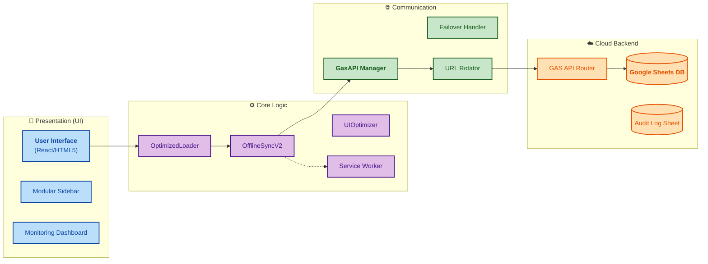
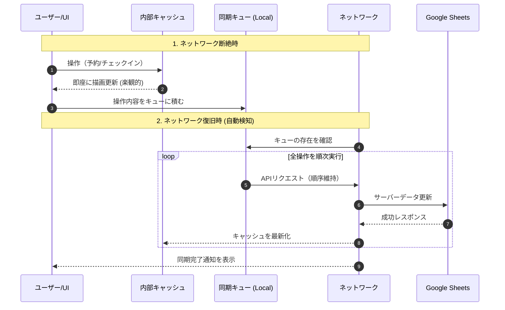

# チケット管理システム v2.3 - 総合技術仕様書 & 運用マニュアル

文化祭や大規模イベント等での利用に特化した、高信頼・低遅延・オフライン対応の座席予約管理システムです。
フロントエンドはビルド不要な Vanilla JavaScript と最新の ES Modules で構成され、バックエンドには Google Apps Script (GAS) を採用することで、サーバーレスかつメンテナンスフリーな運用を実現しています。

---

## 📖 目次

1.  [🚀 システム概要 & 提供価値](#1-システム概要--提供価値)
2.  [🏗️ システムアーキテクチャ (Visual Analysis)](#2-システムアーキテクチャ-visual-analysis)
3.  [🎯 運用モードと権限定義](#3-運用モードと権限定義)
4.  [📖 ロール別・操作運用マニュアル](#4-ロール別操作運用マニュアル)
5.  [🔄 高度なテクニカルサブシステム](#5-高度なテクニカルサブシステム)
6.  [📊 監視・通知・監査ログ](#6-監視通知監査ログ)
7.  [⚙️ セットアップ & 展開ガイド](#7-セットアップ--展開ガイド)
8.  [📁 プロジェクト構成 & マニフェスト](#8-プロジェクト構成--マニフェスト)
9.  [🛡️ セキュリティ & トラブルシューティング](#9-セキュリティ--トラブルシューティング)

---

## 1. システム概要 & 提供価値

本システムは、ネット環境が極めて不安定（または遮断された）現場でも、**「止まることなく、かつデータの完全性を維持する」**ことを目的とした業務支援システムです。

### 🌟 4つのコア・バリュー
*   **Zero-Downtime Offline**: 通信断絶時も全機能を継続利用可能。復帰時に順次自動同期。
*   **Adaptive API Switching**: 複数のGASデプロイURLを自動巡回し、GoogleのAPI実行制限を回避。
*   **iOS-First Optimization**: 低スペック・低メモリのiOS端末でも安定動作するようにメモリ管理を最適化。
*   **Intelligent Monitoring**: 全公演の空席率をリアルタイムで監視し、閾値割れで管理者に即座に通知。

---

## 2. システムアーキテクチャ (Visual Analysis)

### 2.1 全体構成図 (Layered Architecture)
システムを4つのレイヤーに色分けし、それぞれの役割とデータの流れを示します。

### 2.2 オフライン同期・ワークフロー
オフライン時の操作がどのように「楽観的」に処理され、後に同期されるかの流れです。

---

## 3. 運用モードと権限定義

サイドバーから切り替え可能な4つのモードは、システム挙動を劇的に変化させます。

| モード名 | 対象者 | 解放される機能 | 認証 |
| :--- | :--- | :--- | :--- |
| **通常** | 一般のお客様 | 空席の選択、予約の実行。 | 不要 |
| **管理者** | 受付スタッフ | 座席名の表示、個別/一括チェックイン。 | パスワード |
| **当日券** | 当日券デスク | 当日券発行UIの解放、自動連番席確保。 | パスワード |
| **最高管理者** | システム管理 | 全データ直接編集、全ログ閲覧、監視ダッシュボード。 | パスワード |

---

## 4. ロール別・操作運用マニュアル

### 4.1 受付スタッフ向（管理者モード）
*   **ログイン**: サイドバーより「管理者モード」を選択し、パスワード `admin` を入力。
*   **座席確認**: 予約済みの席には予約者の氏名が表示されます。タップで詳細（予約時間等）を確認可能。
*   **チェックイン**: 座席をタップし、「チェックイン」ボタンを押します。複数を同時に選択して一括処理も可能です。
*   **同期異常時**: 画面右上のインジケーターが赤色の場合はオフラインです。そのまま操作を続けて構いませんが、5分以上続く場合は通信環境を再確認してください。

### 4.2 当日券デスク向（当日券モード）
*   **発行手順**:
    1.  「当日券モード」でログイン。
    2.  当日券発行ボタン（walkin.html）をタップ。
    3.  人数（1〜6）を選択。
    4.  「一緒（連続席）」または「どこでも」を選択して発行。
*   **オフライン発行**: オフライン時は画面に「(ローカル処理)」と表示されます。発行された座席番号をメモし、お客様に案内してください。

### 4.3 システム管理者向（最高管理者モード）
*   **データ修正**: 誤った入力があった場合、座席をタップして開く「直接編集モーダル」から、スプレッドシートの C, D, E 列（ステータス、氏名、チェックイン）を直接書き換えられます。
*   **監視**: `monitoring-dashboard.html` を常時表示し、APIエラーの発生や特定の公演の急激な空席減少を注視してください。

---

## 5. 高度なテクニカルサブシステム

### 5.1 API 負荷分散 & Failover 戦略
Google Apps Script の「秒間リクエスト上限」や「1日あたりの実行時間制限」を突破するための仕組みです。

*   **URL Rotator**: `config.js` 内の `GAS_API_URLS` 配列から、5分ごとにランダムなURLを現在の接続先に指定。
*   **Active Failover**: 接続中のURLでタイムアウト (20秒) またはエラーが発生した場合、直ちに別のURLでリベンジ（リトライ）を実行。

### 5.2 Offline Sync V2 (iOS 最適化)
*   **Memory Pressure Control**: iOSのブラウザ制限によるクラッシュを防ぐため、15秒ごとの同期バッチサイズを2〜3件に制限。
*   **Conflict Resolution**: サーバーとの整合性を取るため、同期前には必ず最新の `getSeatDataMinimal` を呼び出し。

### 5.3 PWA & Cache Strategy
`sw.js` が管理するキャッシュ戦略です。

*   **Critical First**: `index.html`, `config.js` 等のコアファイルを最優先で不揮発キャッシュ。
*   **Stale-While-Revalidate**: 静的アセットを読み込む際、キャッシュがあればそれを返しつつ、バックグラウンドで最新版を取得。

---

## 6. API リファレンス (Endpoint Specification)

本システムは、JSONP（GET）および標準的な POST リクエストを受け付けるデュアル・インターフェースを採用しています。

### 6.1 通信プロトコル
*   **Base URL**: `GAS_API_URLS` に定義された各URL。
*   **共通パラメータ**:
    *   `func`: 呼び出す関数名 (String)
    *   `params`: 関数の引数 (JSON Arrayを文字列化したもの)
    *   `callback`: JSONP利用時のコールバック関数名 (String)

### 6.2 主要API関数

| 関数名 | 引数 | 説明 | 戻り値 (JSON) |
| :--- | :--- | :--- | :--- |
| `getSeatData` | `group, day, timeslot, isAdmin, isSuperAdmin` | 全座席の詳細データを取得。 | `{success, seatMap: {id: {status, name, ...}}}` |
| `reserveSeats` | `group, day, timeslot, seats[]` | 複数の座席を一括で「予約済」に更新。 | `{success, message}` |
| `checkInSeat` | `group, day, timeslot, seatId` | 特定の座席を「済」にする。 | `{success, message, checkedInName}` |
| `assignWalkInConsecutiveSeats` | `group, day, timeslot, count` | 指定人数の連続する空席を自動確保。 | `{success, seatIds: [], message}` |
| `verifyModePassword` | `mode, password` | モード切替用のパスワード検証。 | `{success, valid: boolean}` |
| `updateSeatData` | `group, day, timeslot, id, C, D, E` | [最高管理者] スプレッドシートの値を直接上書き。 | `{success, message}` |
| `getSystemLock` | `(none)` | システム全体のロック状態を確認。 | `{success, isLocked: boolean}` |

### 6.3 特殊なAPI
*   **`recordClientAudit`**: クライアント側で発生した重要イベントをサーバーの監査ログに送信。
*   **`sendStatusNotificationEmail`**: 監視システムが異常を検知した際、管理者にHTML通知メールを送信。

### 6.4 JSON ペイロード・サンプル (Data Examples)

実際のリクエスト URL に含まれる `params` の構造例です：

| 関数名 | `params` の中身 (JSON形式の配列) |
| :--- | :--- |
| `reserveSeats` | `["見本演劇", "1", "A", ["A1", "A2"]]` (第4引数は配列) |
| `checkInSeat` | `["見本演劇", "1", "A", "A1"]` |
| `updateSeatData` | `["見本演劇", "1", "A", "A1", "予約済", "山田太郎", "済"]` |
| `assignWalkInConsecutiveSeats` | `["見本演劇", "1", "A", 2]` (数値として人数を指定) |

### 6.5 サーバー側書き込みプロセス (Write Logic)

GASサーバーがリクエストを受信した際の内部シーケンスです：

1.  **スプレッドシートの特定**: 
    `SpreadsheetIds.gs` から `group` に対応する ID を引去し、`day` と `timeslot` を元にシート名を動的に構築 (例: `1-A_Seats`)。
2.  **排他制御 (Atomic Lock)**: 
    `LockService.getScriptLock()` を使用し、最大15秒間の書き込みロックを取得。これにより、同一座席への「同時予約」によるデータ破損を完全に防止。
3.  **状態チェック (Double-Check)**: 
    書き込み直前に再度セルの値を確認。既に「空」でなくなっていた場合はエラーを返し、予約をキャンセル。
4.  **バッチ/単一更新**: 
    予約時は `setValue()`、当日券発行時は `setValues()` (バッチ) を使い分け、API実行時間の短縮とスプレッドシートの保護を両立。
5.  **Flush**: 
    `SpreadsheetApp.flush()` を明示的に呼び出し、レスポンスを返す前にGoogleのデータベースへの物理的な書き込みを強制完了。

---

## 7. 監視・通知・監査ログ

### 7.1 強化ステータス監視 (Thresholds)
`enhanced-status-monitor.js` が以下の基準で自動通知を発動します。

| アラートレベル | 条件 | 管理者のアクション |
| :--- | :--- | :--- |
| **警告 (Warning)** | 空席 $\le$ 5 | 状況を注視、当日券の枚数調整を検討。 |
| **緊急 (Critical)** | 空席 $\le$ 2 | 現場スタッフに完売間近を共有。 |
| **満席 (Full)** | 空席 = 0 | お知らせメールが自動送信されます。 |

### 7.2 監査ログ (Client Audit)
全ての操作は `localStorage` と GAS 経由のスプレッドシートの両方に記録されます。
*   **記録内容**: 操作時刻、SessionID、操作の種類、以前の値 $\rightarrow$ 変更後の値。
*   **閲覧**: 最高管理者パスワードを使用した `logs.html` から全タイムラインを確認可能。

---

## 8. データベース設計 (Database Specification)

本システムは、Google スプレッドシートを「シャーディング（分散サーバー）」のように活用し、高負荷時でもデータの整合性とパフォーマンスを維持する設計になっています。

### 8.1 シャーディング戦略 (Spreadsheet Sharding)
データは一つの巨大なファイルではなく、**「公演（組-日-時間帯）」ごとに独立したスプレッドシートファイル**に保存されます。
*   **メリット**: ファイルごとの500万セル制限の回避、同時書き込み時のロック競合の最小化。
*   **管理手法**: `SpreadsheetIds.gs` 内の `SEAT_SHEET_IDS` 定数にて、`{組}-{日}-{時間帯}` の複合キーとスプレッドシートIDをマッピング。

### 8.2 物理スキーマ (Sheet Layout)
各スプレッドシート内の `Seats` シートは以下の5列構成で正規化されています。

| 列 | 項目名 | データ型 | 説明 |
| :--- | :--- | :--- | :--- |
| **A** | `Row` | String | 座席の行番号（例: `A`, `B`, `1`, `2`）。 |
| **B** | `Col` | String | 座席の列番号（例: `1`, `2`, `左`, `右`）。 |
| **C** | `Status` | String | 現状ステータス。 `空`, `確保`, `予約済` のいずれか。 |
| **D** | `Name` | String | 予約者の氏名（当日券の場合は `当日券_YYYY/MM/DD...`）。 |
| **E** | `Check-in` | String | チェックインフラグ。 `済` または 空白。 |

### 8.3 監査 & ログテーブル
*   **`Log` シート**: `logOperation` 関数により、APIが叩かれた全履歴（実行時間、引数、結果）を保存。
*   **`Audit` シート**: `recordClientAudit` により、クライアント端末（ブラウザ）側で発生した重要イベントやUI操作ログを収集。

---

## 10. バックエンド内部ロジック詳説 (Backend Internal Logic)

GAS 側に実装されている高度な操作ロジックの詳細です。

### 10.1 連続席確保アルゴリズム (`assignWalkInConsecutiveSeats`)
当日券の連番発行時、システムは以下の手順で計算を行います：
1.  **行単位の探索**: A行から順に E行まで、同一行内で指定枚数の連続した空席があるかを確認。
2.  **ソートと検証**: 列番号を数値として昇順ソートし、`n, n+1, n+2...` の連続性を判定。
3.  **行跨ぎの禁止**: ユーザーの利便性を考慮し、行を跨ぐ（例：A12とB1をセットにする）確保は行わない。

### 10.2 自律的ログ・クリーンアップ
スプレッドシートの動作低下を防ぐため、システムは自動的にサイズを適正に保ちます。
*   **サーバーログ**: `logOperation` 実行時、過去1,000件を超えた古いログを自動削除。
*   **クライアント監査ログ**: `recordClientAudit` 実行時、過去5,000件を超えた古いログを自動削除。

---

## 11. セットアップ & 展開ガイド

### STEP 1: スプレッドシート側の設定
1. 各公演用のシートに `Seats` シートを作成。
2. レイアウト: A=行、B=列、C=ステータス（空/確保/予約済）、D=氏名、E=チェックイン（済）。

### STEP 2: GAS バックエンドのデプロイ
1. `GAS/core/ver.7/` の全コードをGASエディタに配置。
2. `SpreadsheetIds.gs` に各公演のIDを入力。
3. `system-setting.gs` の `setupPasswords()` を実行。

### STEP 3: フロントエンドのデプロイ
1. `config.js` の `GAS_API_URLS` を作成したデプロイURL群に更新。
2. 任意のHTTPSサーバーに全ファイルをアップロード。

### STEP 4: タイムスケジュールの変更
各組の公演時間は `TimeSlotConfig.gs` 内の `TIMESLOT_SCHEDULES` 定数で管理されています。変更が必要な場合は、GASエディタから直接編集した後に保存してください。

---

## 12. プロジェクト構成 & マニフェスト (Project Manifest)

### 12.1 フロントエンド (Client-side)
*   `api.js / optimized-api.js`: 通信レイヤーの基幹。
*   `offline-sync-v2.js`: 端末内DBと同期キューの管理。
*   `enhanced-status-monitor.js`: 異常検知と通知メールのトリガー。
*   `sw.js`: PWA化およびオフラインキャッシュ。

### 12.2 バックエンド (GAS-side)
*   `Code.gs`: APIエントリポイント、ビジネスロジック。
*   `SpreadsheetIds.gs`: 公演DBマッピング（シャーディングキー）。
*   `TimeSlotConfig.gs`: 全公演のタイムテーブル設定。
*   `system-setting.gs`: パスワード・環境変数管理。

**総開発規模: 25,524行**（[詳細レポート](.VSCodeCounter/2026-04-21_02-16-13/details.md)）

---

## 13. セキュリティ & トラブルシューティング

### 🛡️ セキュリティポリシー
*   **パスワードハッシュ**: モード切替時のパスワードはGASサーバー側で検証。
*   **機密情報除去**: URLパラメータに含まれるパスワード情報は、初回読み込み直後に `history.replaceState` で隠蔽。

### 🚨 FAQ
*   **Q: 特定の座席が「予約不可」のまま動かない**
    *   A: 最高管理者モードで対象の座席をタップし、ステータスを直接「空」に書き換えてください。
*   **Q: iOSで画面がリロードされる**
    *   A: メモリ不足の可能性があります。他の不要なタブを閉じ、PWA版（ホーム画面に追加）を推奨してください。

---

**Copyright (c) 2025 Junxiang Jin.**  
MIT License に基づき提供。詳細なライセンス条項は [LICENSE](LICENSE) を参照してください。
