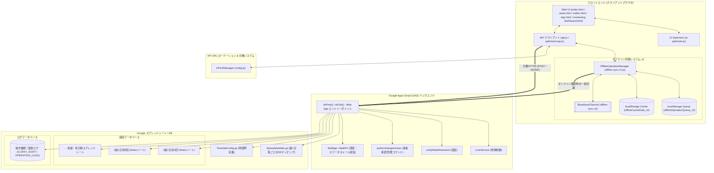
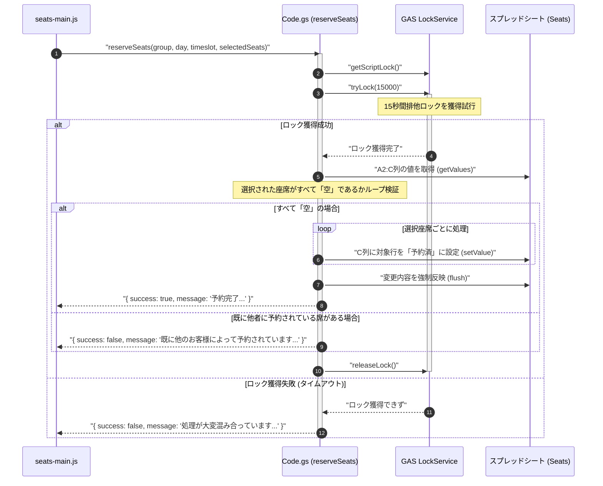
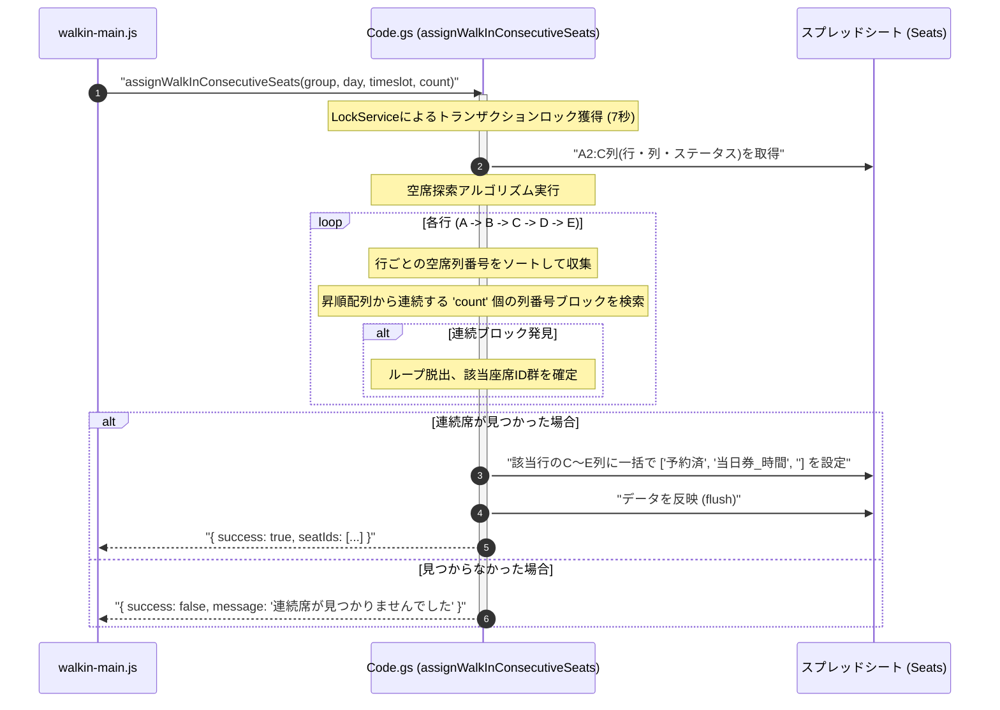
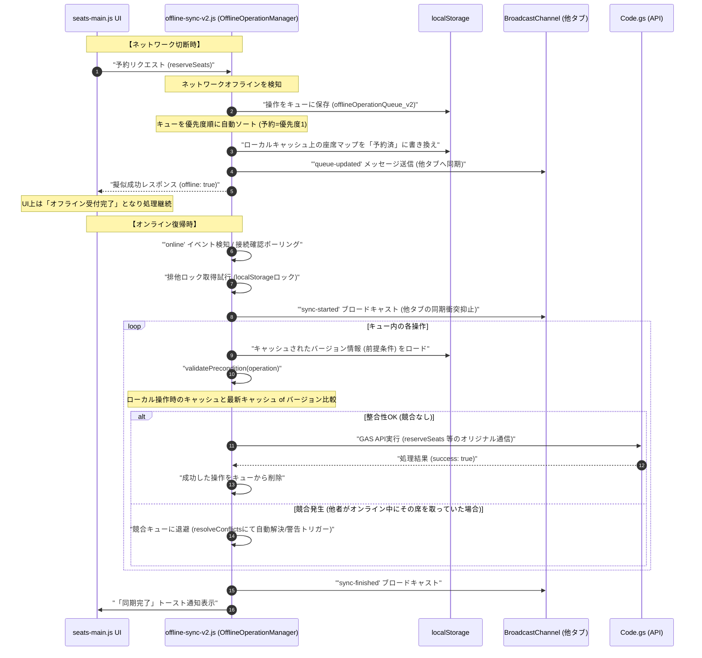
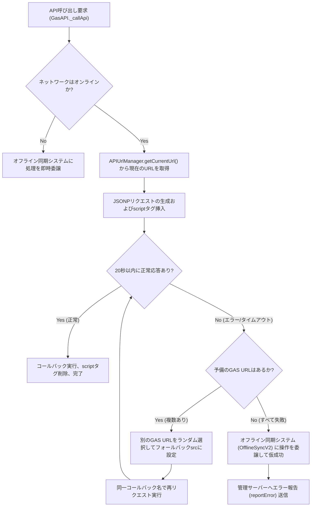
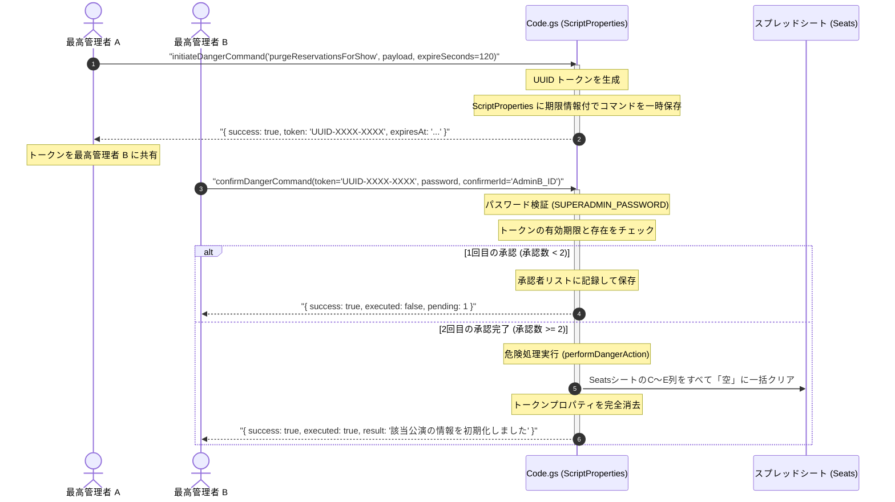

# 市川学園座席管理システム 詳細仕様・運用管理ドキュメント

本システムは、文化祭等のイベントにおける「座席予約」「受付チェックイン」「当日券の自動割り当て・発行」を、Google Apps Script (GAS) およびスプレッドシートをバックエンドとして高速かつ強固に実現するリアルタイム座席管理システムである。本ドキュメントでは、システムの全体概要、アーキテクチャ、データモデル、詳細ビジネスロジック、および運用手順について解説する。

---

## 1. システム全体概要とアーキテクチャ

### 1.1 システムの目的とコア機能

#### 解決する課題
1. **GASの同時実行限界とパフォーマンス低下の回避**  
   GASは同時通信時にリクエストが衝突しやすく、実行速度に制限がある。本システムでは、複数のGAS公開URL（Web App）に通信を分散する「ローテーション機構」および「onerrorフェイルオーバー」により、高い耐障害性とアクセス分散を実現する。
2. **ネットワーク不安定環境（オフライン状態）での運用継続**  
   文化祭会場などの混雑によるネットワーク切断に耐えるため、クライアント側で操作データを蓄積し、オンライン復帰時にサーバー側の状態との整合性を確認しながら自動で再同期する「オフラインファースト」アーキテクチャを実装する。
3. **二重予約（ダブルブッキング）の完全防止**  
   限られた座席資源に対して同時に予約リクエストが集中した際、GASの `LockService` による厳格なトランザクション制御を行い、排他ロックの獲得とスプレッドシートへのバッチ同期処理を行うことで、二重予約を完全に防止する。

#### コア機能
* **ビジュアル座席マップ制御 (`seats.html` / `seats-main.js`)**  
  A〜D列（12席）およびE列（6席、変則配置）の座席状態をカラー表示し、一般ユーザーの予約選択、管理者のチェックイン選択、最高管理者のデータ編集をシームレスに行う機能。
* **当日券自動発行 (`walkin.html` / `walkin-main.js`)**  
  「連続席（同一行内での連番確保）」または「ランダム空席」を指定枚数（1〜6枚）瞬時に自動検索し、確保・発行する機能。
* **オフライン同期システム v2 (`offline-sync-v2.js`)**  
  `localStorage` を活用した操作キュー管理、`BroadcastChannel` を用いた複数タブ間の状態同期および排他ロック獲得、同期時の「前提条件の整合性（衝突）検証」機能。
* **API分散・耐障害性制御 (`config.js` / `api.js`)**  
  5分間隔の自動URLローテーション、通信失敗時のランダムフェイルオーバー、およびPOST失敗時のJSONP自動フォールバック機能。
* **統合監視ダッシュボード (`monitoring-dashboard.html`)**  
  残り座席率（満席検知）、エラー発生率、レスポンスタイム、キャッシュヒット率をリアルタイムにビジュアル監視し、異常時に指定メールアドレスへ警告メールを自動送信する機能。
* **多者承認付き危険コマンド実行システム (`Code.gs`)**  
  予約データの全削除といった破壊的操作に対し、2人以上の最高管理者（SUPERADMIN）による承認（トークン発行＋個別承認）を必要とする安全機構。

---

### 1.2 アーキテクチャ構成図



---

### 1.3 ディレクトリ・モジュール構造

ワークスペース内の主要ファイル配置と役割は以下の通りである。

```
c:\dev\tickets-beta
├── GAS/                         <-- GAS (Google Apps Script) バックエンドソース
│   ├── core/
│   │   └── ver.7/
│   │       ├── Code.gs          <-- APIのエントリーポイント、トランザクション、ビジネスロジックの中核 (90KB)
│   │       ├── SpreadsheetIds.gs <-- 組(1~8組,見本)×日程(1~2日)×回(A~C)とスプレッドシートIDのマッピング定義
│   │       ├── TimeSlotConfig.gs <-- 各公演回に対応する実際の開演・終演時刻スケジュールの定義
│   │       └── system-setting.gs <-- 管理者・当日券・最高管理者のパスワード設定ユーティリティ
│   ├── reservation-again/       <-- 保護者向け二次募集・再予約用GASテンプレート (全6公演対応)
│   ├── tickets-for-parents/     <-- 保護者用整理券発行用GASテンプレート (単一公演、自動メール送信機能付)
│   └── tickets-for-teachers/    <-- 教員用整理券発行用GASテンプレート (全クラス・全96公演、自動メール送信機能付)
├── api.js                       <-- クライアント側API通信コア。POST/JSONP通信、フェイルオーバー、オフライン委譲処理
├── api-cache.js                 <-- ローカルキャッシュ(localStorage)への座席データの読み書き、キャッシュヒット率計測
├── audit-logger.js              <-- クライアント側の操作やAPI応答を統合監査ログとしてメモリにバッファリングするモジュール
├── config.js                    <-- 接続先GAS URL群定義、APIUrlManagerによる自動ローテーション、デモ/ゲネプロモード制御
├── offline-sync-v2.js           <-- オフライン操作の蓄積、 BroadcastChannel 排他制御、整合性チェック付自動同期 (121KB)
├── seats.html / seats-main.js   <-- 座席マップのビジュアル描画、予約選択、チェックイン選択、管理者用編集UI制御
├── seats.css                    <-- 座席マップ専用のレスポンシブスタイル、ステータス別グラデーション表示
├── walkin.html / walkin-main.js <-- 当日券発行UI。枚数指定、連続席/ランダム席選択、発行結果チケット表示
├── walkin.css                   <-- 当日券発行用デザイン
├── timeslot.html / timeslot-main.js <-- 公演回スケジュールの一覧・管理画面
├── logs.html / logs-main.js     <-- サーバー操作ログ、クライアント監査ログの可視化ダッシュボード
├── monitoring-dashboard.html    <-- 統合監視ダッシュボード。空席分析、メール通知先設定、エラー統計
├── enhanced-status-monitor.js   <-- 空席状況を定期チェックし、警戒・緊急レベルに応じてGASメール通知をトリガーする監視コア
├── performance-monitor.js       <-- 通信時間、キャッシュヒット率、メモリ消費などのパフォーマンス測定器
├── ui-optimizer.js              <-- スクロール慣性、DOM再描画抑制、iOS Safariスクロールバグ修正などのUI最適化
├── sw.js / pwa-install.js       <-- サービスワーカーによる静的アセットのキャッシュと、PWAインストールプロンプト制御
└── system-lock.js               <-- システム全体の予約受付ロックを管理。GAS API 'getSystemLock' と連動
```

---

## 2. 技術仕様解説

### 2.1 データモデルと状態管理

#### 2.1.1 スプレッドシート（データベース）テーブル構造
本システムは、各公演回に対応するスプレッドシート内の **`Seats`** シートを主テーブル（座席マスタ兼トランザクションテーブル）として扱う。

##### `Seats` シートの構造 (A〜E列)

| 列 | ヘッダー名 | 型 | 説明 | 値の具体例 |
| :--- | :--- | :--- | :--- | :--- |
| **A** | 行 | `string` | 座席の行ラベル (A〜E) | `A`, `B`, `C`, `D`, `E` |
| **B** | 列 | `number` | 座席の列番号 (1〜12) | `1`, `2`, `12` |
| **C** | 予約ステータス | `string` | 座席の販売・確保状態 | `空`, `予約済`, `確保` |
| **D** | 予約者名 / ラベル | `string` | 予約したユーザー名、または当日券発行情報 | `山田 太郎`, `当日券_2026/05/19 01:36:33` |
| **E** | 受付ステータス | `string` | 会場へのチェックイン状態 | `済`, `空文字` |

#### 2.1.2 ログ・監査データ構造
操作履歴およびセキュリティログは、ログ用のスプレッドシート（`LOG_SPREADSHEET_ID`）の2つのシートに記録される。

##### 1. `OPERATION_LOGS` シート (サーバー側操作ログ)
GAS上の `logOperation` 関数によって記録され、直近1000件で自動ローテーションされる。
* `Timestamp`: 処理日時（`Date`）
* `Operation`: 呼び出されたAPI関数名（`getSeatData`, `reserveSeats` など）
* `Parameters`: 呼び出しパラメータ（`JSON.stringify(params)`）
* `Result`: API応答データ（`JSON.stringify(result)`）
* `UserAgent`: クライアントブラウザのUserAgent
* `IPAddress`: クライアントのIPアドレス（GAS側で検知）
* `Status`: `'SUCCESS'` または `'ERROR'`

##### 2. `CLIENT_AUDIT` シート (クライアント監査ログ)
クライアント側での詳細な操作ログで、直近5000件で自動ローテーションされる。
* `Timestamp` / `EventType` / `Action` / `Metadata` (JSON) / `SessionId` / `UserId` / `UserAgent` / `IPAddress`

---

#### 2.1.3 主要な状態管理 (State Management)

1. **座席状態 (Seat Status)**  
   スプレッドシートの C列およびE列の組み合わせから、フロントエンド側で以下の5つの状態にマッピングして管理される。
   * `available` (空席): C列が `空` または `空文字`。
   * `to-be-checked-in` (予約済・未チェックイン): C列が `予約済` かつ E列が `空文字`。
   * `checked-in` (チェックイン済): C列が `予約済` かつ E列が `済`。
   * `reserved` (確保): C列が `確保`。
   * `unavailable` (利用不可): それ以外の値。
2. **動作モード (Access Mode)**  
   `localStorage` の `'currentMode'` キーで管理される。
   * `'normal'`: 一般ユーザー向け画面。座席予約のみ可能。
   * `'admin'`: 受付スタッフ向け画面。座席タップによるチェックイン処理が可能。
   * `'walkin'`: 当日券発券端末向け画面。当日券の自動割り当て発行のみ可能。
   * `'superadmin'`: 最高管理者向け画面。座席情報の強制書き換え、システムロック、危険コマンド実行が可能。
3. **グローバルシステムロック (System Lock)**  
   GASの `PropertiesService` 内のプロパティ `'SYSTEM_LOCKED'` (`'true'` / `'false'`) で管理される。これが `'true'` の場合、一般ユーザーからの `reserveSeats` リクエストはAPIレベルで遮断され、「システムロック中」のエラーを返却する。

---

### 2.2 主要なビジネスロジックとワークフロー

#### 2.2.1 座席予約プロセス（同時実行制御・ロック）
複数のユーザーが同時に同じ席を予約した際、ダブルブッキングを防ぐための排他制御（トランザクション）フローである。



1. フロントエンド `seats-main.js` の `confirmReservation` 関数から、選択された座席IDの配列（例: `['A5', 'A6']`）を引数にして、`GasAPI.reserveSeats` を呼び出す。
2. GASの `reserveSeats` 関数（`Code.gs`）が実行されると、まず `LockService.getScriptLock()` によってスクリプト全体に対する排他ロックオブジェクトを取得する。
3. `lock.tryLock(15000)` により、**15秒間**ロックの獲得を試みる。他のリクエストが処理中の場合はキューに並んで待機する。15秒以内にロックが取得できない場合は、即座に安全なエラーレスポンス（「処理が混み合っています」）を返却する。
4. ロック獲得に成功すると、シートデータから該当する座席範囲（A2:C列）の値を一括ロードする。
5. 選択された座席がすべて現在 **`空`** ステータスであるかをループで確認する。もし1席でも `空` 以外の値（`予約済` や `確保`）が含まれていた場合、**即座にエラー例外**を投げ、処理をロールバック（中断）する。
6. 全席が `空` であることが確認できたら、対象のセル（C列）へ **`予約済`** をバッチで書き込む。
7. `SpreadsheetApp.flush()` を呼び出して、Googleスプレッドシートの物理データストアに変更を強制的にコミット（反映）する。
8. 最後に `lock.releaseLock()` によりロックを開放し、他の待機中リクエストに制御を譲る。

---

#### 2.2.2 当日券自動発行プロセス（連続席・ランダム席）
当日券発行端末（`walkin-main.js`）から、希望枚数（1〜6枚）を受け取り、最適な座席を自動で探し出して即時確保するロジックである。



1. フロントエンドの `issueWalkinConsecutive`（連続席）または `issueWalkinAnywhere`（ランダム空席）がクリックされると、選択された枚数 `count` をもとに、GASの `assignWalkInConsecutiveSeats`（`Code.gs`）が呼び出される。
2. **空席探索アルゴリズム (連続席)**:
   * GASは座席マスタから `A2:C` 列（行ラベル、列番号、予約ステータス）を取得する。
   * 行ごとに、ステータスが `'空'` になっている座席の列番号を抽出し、昇順にソートした配列を生成する。
   * 各行の列番号配列に対し、インデックス順に `arr[i] === arr[i-1] + 1` の条件を満たす連続したブロックがあるかを判定する（`findConsecutive` 内部関数）。
   * A行から順番に探索を行い、最初に指定枚数（`count`）を満たす連続席が見つかった時点で探索を終了する。これにより、別々の行に分かれることなく、必ず隣同士の連番席が確保される。
3. **座席の確保・書き込み**:
   * 確保された座席に対して、C列に `'予約済'`、D列に `'当日券_yyyy/MM/dd HH:mm:ss'` というタイムスタンプ付きのラベル、E列に空文字を一括設定する。
   * 最適化のため、連続するセル範囲は `sheet.getRange(startRow, 3, values.length, 3).setValues(values)` を用いて**単一のAPIコール**で高速にバッチ書き込みを行う。

---

#### 2.2.3 オフライン操作のローカル疑似実行＆オンライン復帰自動同期（Offline Sync v2）
通信切断中（オフライン）でも一切業務を止めず、オンラインに復帰した際、データの衝突を防ぎながら整合性を保って自動同期するインテリジェントな同期ロジックである。



1. **オフライン時の処理**:
   * クライアントのAPI通信（`api.js`）が `navigator.onLine === false` またはタイムアウトを検知すると、特別なレスポンス `{ success: false, error: 'offline_delegate' }` を返して `OfflineSyncV2` に処理を委譲する。
   * `addOperation`（`offline-sync-v2.js`）が呼び出され、操作内容（引数、タイムスタンプ、優先度など）と、その時点のローカルキャッシュのバージョンを「前提条件（`precondition`）」としてキャプチャし、`localStorage` のキューに格納する。
   * 同時に、ローカルキャッシュ内の座席マップデータを更新し、UI上はあたかも処理が成功したかのように表示する。さらに、`BroadcastChannel` を通じて他のタブへキューが追加されたことを通知する。
2. **オンライン復帰時の同期（衝突防止）**:
   * ネットワーク接続の復帰を検知すると、`performSync`（`offline-sync-v2.js`）が起動する。
   * 他のタブと同時に同期が走るのを防ぐため、`localStorage` にロックキー（`offline_sync_lock_v2`）を書き込んで排他制御を行う。
   * キュー内の操作を順番に処理する際、`validatePrecondition`（`offline-sync-v2.js`）を実行する。操作時のキャッシュバージョンと、現在のサーバー側のキャッシュバージョンを比較する。
   * 整合性が確認できれば、本来のGAS APIを呼び出してサーバーデータを更新し、キューから削除する。もしバージョンが異なっており、既にその座席が他人に予約されていた場合は、「前提条件競合」として検知し、ユーザーに警告を表示して手動または自動の解決ロジック（`resolveConflicts`）に移行する。

---

#### 2.2.4 API通信のURLローテーション・耐障害性フェイルオーバー
GASの同時接続数上限や割り当て制限（Quota）を自動的にすり抜け、1つのサーバーがダウンしても別のサーバーで瞬時にカバーする、通信継続ロジックである。



1. フロントエンドからのすべての通信は、直接URLを叩くのではなく、`APIUrlManager`（`config.js`）を仲介する。
2. `APIUrlManager` はあらかじめ定義された複数の異なるGAS Web App URL（`GAS_API_URLS`）を保持しており、起動時にランダムに最初のURLを選択する。
3. **自動ローテーション**: 5分ごとに、使用するURLを自動的に別のものへ切り替える。これにより、単一のGoogleアカウントにおける同時接続制限や実行時間枠の枯渇を完全に防止し、トラフィックを均等に分散する。
4. **onerrorフェイルオーバー（耐障害性）**: 
   * JSONPリクエスト送信時にスクリプトの読み込みエラー（HTTP 500エラーやGASのデプロイ切れなど）が発生した場合、`script.onerror`（`api.js`）がトリガーされる。
   * エラーハンドラは、動作中のURLとは別のGAS URLをリストから選択し、スクリプトタグの `src` をその場で書き換えてリクエストを再試行する。これにより、クライアントの画面をフリーズさせることなく自動復旧する。
   * タイムアウト（20秒）が発生した場合も同様に、オフライン同期システムに自動で処理を引き継ぎ、データの破損を防ぐ。

---

#### 2.2.5 最高危険度コマンドの多者承認プロセス（MFA/M-of-N）
スプレッドシート上の予約データを全初期化するなど、誤操作や単独の悪意によってシステムが破壊されるのを防ぐための、二重署名式セキュリティワークフローである。



1. **コマンドの開始 (Initiate)**:
   * 最高管理者Aが、ブラウザコンソールから危険コマンドを実行しようとすると、バックグラウンドで `initiateDangerCommand` が起動する。
   * GASはUUIDトークンを生成し、コマンド内容、実行用ペイロード、有効期限（デフォルト120秒）を含めたレコードを、`PropertiesService.getScriptProperties()` を利用して一時プロパティ（`DANGER_CMD_UUID`）に書き込み、トークンを返却する。
2. **多者承認 (Confirmation)**:
   * コマンドを実際に実行するためには、別のデバイスまたはブラウザにいる最高管理者Bが、同じトークンを指定して `confirmDangerCommand` を実行する必要がある。
   * GAS側で `SUPERADMIN_PASSWORD` の照合およびトークンの期限切れチェックが行われる。期限（120秒）が過ぎている場合は、プロパティは自動消去され実行は拒否される。
   * 異なる承認者IDからの承認数が規定数（`required = 2`）に達した瞬間に、初めて `performDangerAction` がトリガーされ、対象スプレッドシートの予約データが完全にクリアされる。

---

### 2.3 エラーハンドリングとセキュリティ仕様

#### 2.3.1 例外処理と自動修復の方針
1. **クライアント側 (api.js / error-handler.js)**:
   * API通信で例外が発生した場合、エラー内容を画面上のエラーコンテナ（`#error-container`）に自動描画し、サーバー側のエラー監視APIである `reportError` をコールして、バックグラウンドで開発者へ通知する。
   * サービスワーカー（Service Worker）の自己修復機能（`sw-self-heal`）が実装されており、読み込み異常が多発した場合はキャッシュを自動パージしてサーバーから最新のJavaScriptファイルを強制リロードする。
2. **サーバー（GAS）側 (Code.gs)**:
   * すべての関数は `try-catch` ブロックで包括的に保護されており、内部で発生したエラー（スプレッドシートの存在エラーなど）は、呼び出し元のシステム動作を妨げないよう、専用の共通ログ出力ユーティリティ（`safeLogOperation`）を通じて安全にログシートに書き出す。

#### 2.3.2 バリデーション仕様
* **座席IDバリデーション (`isValidSeatId`)**:  
   クライアントおよびGAS側の両方で厳格に検証される。
   * 形式: 正規表現 `/^([A-E])(\d+)$/` にマッチすること。
   * 最大席数チェック: A〜D行は12列以下（1〜12）、E行は6列以下（1〜6）であること。これ以外の座席ID（例: `E7`, `F1`）の予約やチェックインリクエストは、サーバー側で即座に遮断される。

#### 2.3.3 セキュリティとパスワード認証
本システムはIDによるユーザー個別管理ではなく、端末用途に最適化した**「パスワードによるロール（権限）認証」**を採用する。
パスワードはスプレッドシート側ではなく、外部から一切閲覧できない GAS の **`ScriptProperties`** に暗号化保存されている。

* **管理者権限 (ADMIN)**:  
   `ADMIN_PASSWORD`（初期値 `'admin'`）を使用する。主に受付用のPC・タブレットで使用され、座席マップでのチェックイン（`checkInMultipleSeats`）操作権限を持つ。
* **当日券発行権限 (WALKIN)**:  
   `WALKIN_PASSWORD`（初期値 `'walkin'`）を使用する。当日券発券専用端末で使用され、座席マップは見せず、自動割り当て発行機能のみに限定アクセスできる。
* **最高管理者権限 (SUPERADMIN)**:  
   `SUPERADMIN_PASSWORD`（初期値 `'superadmin'`）を使用する。座席情報の直接上書き更新（`updateSeatData`）、システムロックの適用、危険コマンドの実行権限を持つ。

---

## 3. 操作・運用手順書

### 3.1 開発環境構築およびデプロイ手順

#### 3.1.1 フロントエンドのローカル起動手順
本システムは Vanilla HTML/JS/CSS で構築されているため、特別なビルドプロセスを必要とせず、PWAに対応したローカルサーバーがあれば即時開発・稼働可能である。

1. **前提条件**:  
   PCに Node.js（バージョン16以上推奨）がインストールされていること。
2. **依存パッケージのインストール**:  
   プロジェクトのルートディレクトリでコマンドプロンプト（またはPowerShell）を開き、静的サーバーパッケージをインストールする。
   ```bash
   npm install -g http-server
   ```
3. **ローカルサーバーの起動**:  
   ```bash
   http-server -p 5000
   ```
   起動後、ブラウザで `http://localhost:5000` にアクセスして動作を確認する。

---

#### 3.1.2 バックエンド (GAS) のデプロイ手順

1. **Googleスプレッドシートの新規作成**:
   * Googleドライブ上でスプレッドシートを新規作成し、シート名を **`Seats`** に変更する。
   * A1〜E1セルにそれぞれ `行`, `列`, `予約ステータス`, `予約者名`, `受付ステータス` とヘッダーを入力する。
   * 座席データ（A2:E列）として、A列に `A`〜`E`、B列に `1`〜`12`（E列は6まで）を入力し、C列はすべて `空` と入力する。
2. **GASエディタの起動**:
   * スプレッドシートのメニューから「拡張機能」→「Apps Script」を選択する。
3. **ソースコードの配置**:
   * GASエディタ上に、プロジェクトの `GAS/core/ver.7/` 配下にあるファイルをコピー＆ペーストして保存する。
4. **初期IDおよびスケジュールの設定**:
   * `SpreadsheetIds.gs` の `SEAT_SHEET_IDS` に、作成したスプレッドシートのIDを組・日程ごとに書き込む。
   * 同様に、ログ記録用スプレッドシートを作成し、そのIDを `Code.gs` 上の `PropertiesService` 設定用プロパティ `LOG_SPREADSHEET_ID` に登録する。
5. **パスワードの初期セットアップ**:
   * GASエディタの関数一覧から `setupPasswords` を選択し、「実行」をクリックする。これにより、ScriptPropertiesに必要な初期パスワード（`admin` / `walkin` / `superadmin`）が書き込まれる。
6. **Webアプリとしてのデプロイ**:
   * 右上の「デプロイ」→「新しいデプロイ」を選択する。
   * 種類の選択で「Web アプリ」を選択する。
   * 各設定項目を以下のように指定する。
     * 説明: `市川学園座席管理システム API v7`
     * 次のユーザーとして実行: `自分`
     * アクセスできるユーザー: `全員`
   * 「デプロイ」をクリックし、生成された **「Web アプリのURL」** をコピーする。
7. **フロントエンドの設定変更**:
   * クライアントソースの `config.js` の `GAS_API_URLS` 配列に、コピーした Web アプリURLを貼り付ける。

---

### 3.2 主要機能の操作手順（ユースケース別）

#### 3.2.1 【エンドユーザー】一般座席予約の手順
文化祭の一般来場者が、スマホやタブレットで自ら空き席を選択して予約を行う手順である。

1. **画面へのアクセス**:
   * 一般来場者向け端末で `index.html` にアクセスし、対象の「組」「日程（1日目/2日目）」「時間帯」を選択して座席マップに遷移する。
2. **座席の選択**:
   * 画面上に緑色で表示されている「空」の座席（`available`）の中から、希望する座席をタップする。
   * タップされた座席は枠線が強調され、選択状態になる（複数選択可能）。
   * 画面下部のボタンが「この席で予約する (N席: X1, X2...)」に変化する。
3. **予約の確定**:
   * 下部の「この席で予約する」ボタンをタップする。
   * 「予約を確定しますか？」のダイアログが表示されるので、「はい」をタップする。
4. **確認方法**:
   * 予約完了メッセージが表示された後、座席マップが自動更新され、選択した座席が緑色（空席）から**青色**（予約済・未チェックイン）に変化していることを確認する。

---

#### 3.2.2 【受付スタッフ】バーコード不要の直接チェックイン手順
入場口の受付担当者が、予約済みの来場者を現地でチェックイン（入場処理）する手順である。

1. **管理者モードへのログイン**:
   * 座席マップ画面の左上の三本線アイコンからメニューを開き、「モード切り替え」を選択する。
   * 「管理者モード（ADMIN）」を選択し、管理者パスワード（初期値: `admin`）を入力してログインする。
   * ログイン成功後、画面上部に黄色のバーで **「管理者モードで動作中」** と表示される。
2. **チェックイン対象席の選択**:
   * 来場者が予約した座席（青色の「予約済」座席）をタップする。
   * 選択された座席は枠線が赤く強調される（複数座席をまとめて一括選択可能）。
3. **チェックインの実行**:
   * 画面下部に表示される **「選択した座席をチェックインする」** ボタンをタップする。
   * 確認メッセージに対して「OK」を選択する。
4. **確認方法**:
   * 処理完了後、該当の座席が青色から**グレー（チェックイン済）**に変化し、座席上にチェックマークが表示されていることを確認する。

---

#### 3.2.3 【発券スタッフ】当日券のスピード自動発行手順
当日券配布所で、来場者にその場で当日チケットを高速に発券する手順である。

1. **当日券モードへのログイン**:
   * `index.html` または `seats.html` のメニューから「当日券モード（WALKIN）」を選択し、当日券パスワード（初期値: `walkin`）を入力してログインする。
2. **発行枚数の指定**:
   * `walkin.html` 画面に遷移する。画面中央の数量セレクターで、発券したい枚数を `+` / `-` ボタンで指定する（1〜6枚）。
3. **発行方式の決定**:
   * **「当日券を発行する」** をタップするとオプションモーダルが開く。
   * **「隣同士の連続席で発行する」**: グループ全員が隣り合って座れる席をシステムが検索する。
   * **「空いている席ならどこでもよい」**: バラバラになってもよいので、現時点のすべての空席から高速で自動確保する。
4. **チケットの発券と確認**:
   * 確保が成功すると、画面上に **「当日券を発行しました！座席は 【A5 / A6】 です。」** のように確定座席番号が大きくビジュアルカードで描画される。
   * スタッフはこの座席番号を当日券の紙チケットに転記して来場者に手渡す。
   * 満席の場合は「大変申し訳ありませんが満席です」とエラー表示される。

---

#### 3.2.4 【最高管理者】データ強制修正およびシステムロックの手順
座席のダブルブッキングトラブル時の強制席替えや、開演後の新規予約の受付停止を行う手順である。

1. **最高管理者モードへのログイン**:
   * メニューから「最高管理者モード（SUPERADMIN）」を選択し、最高管理者パスワード（初期値: `superadmin`）を入力してログインする。
   * 画面上部に赤色のバーで **「最高管理者モードで動作中」** と表示される。
2. **座席データの直接修正（席替え・強制解放）**:
   * 修正したい座席をタップすると、専用の「座席編集モーダル」が起動する。
   * 以下の項目を編集可能である。
     * **予約ステータス**: `空` / `予約済` / `確保` から選択。
     * **予約者名**: 氏名やラベルを書き換える。完全に空席にする場合は空欄にする。
     * **受付ステータス**: `未受付` / `受付済(済)` から選択。
   * 「保存する」ボタンをタップすると、サーバー側のスプレッドシートデータが直接更新され、即座に全員の画面に反映される。
3. **予約受付の強制停止（システムロック）**:
   * 最高管理者メニューの「システム一括ロック」のトグルスイッチを「ON」にする。
   * これにより、一般ユーザー画面での座席予約ボタンはグレーアウトされ、API通信も完全にロックされる。

---

### 3.3 トラブルシューティング

本システムで運用中に発生が想定される代表的なエラーメッセージと、その具体的な対処手順である。

#### 3.3.1 「既に他のお客様によって予約されています」
* **発生状況**: 一般予約または当日券発行時に、選択した座席がミリ秒単位の差で他の端末から先に確定されてしまった場合に発生する。
* **対処手順**:
  1. 画面上にエラーダイアログが表示されたら、「了解」をタップして閉じる。
  2. 画面上部にある「手動更新（更新マーク）」ボタンをタップし、最新の空席状況を強制ロードする。
  3. 他の緑色（空席）の座席を選択し直し、再度予約を実行する。

#### 3.3.2 画面右上に「オフライン（赤色表示）」が出現し、操作が保留される
* **発生状況**: 会場の混雑やWi-Fiの遮断によって、端末がインターネットから完全に切断された場合に表示される。
* **対処手順**:
  1. **スタッフへの周知**: システムは「オフライン同期システム v2」によりバックグラウンドで動作を維持しているため、**ブラウザをリロード（F5）せず、そのまま予約やチェックインの操作を継続する。**
  2. 操作を行うと「オフラインで受け付けました」と通知され、ローカルメモリに一時保存される。
  3. Wi-Fiルーターの再起動や移動を行い通信を復旧させる。オンライン状態に戻ると、右上インジケーターが「オンライン」に変わり、**保留されていたすべての操作が自動的にサーバーへ同期される。**

#### 3.3.3 「JSONPリクエストに失敗しました」または「通信タイムアウト」
* **発生状況**: 接続している特定のGoogle Apps Script（GAS）がGoogle側の同時通信制限に引っかかったか、通信強度の低下によりAPI応答が20秒間なかった場合に発生する。
* **対処手順**:
  1. フロントエンドは自動的に別の予備GASサーバーへのフェイルオーバーを裏で実行するため、**5〜10秒ほど待機**する。
  2. 復旧しない場合は、手動で画面上の「更新（手動ローテーション）」ボタンをタップし、強制的に別のAPI URLへ切り替える。
  3. 通信エラーが頻発する場合は、`config.js` の `GAS_API_URLS` のデプロイ状態を最高管理者がGoogle Apps Script管理コンソールから確認し、必要に応じて新しくデプロイを作成し直してURLを更新する。

#### 3.3.4 「認証に失敗しました」
* **発生状況**: 管理者モード、当日券モード、最高管理者モードへの切り替え時に入力したパスワードが誤っている場合に発生する。
* **対処手順**:
  1. アルファベットの「大文字・小文字」の入力ミスや、スペースが紛れ込んでいないかを確認する。
  2. パスワードを忘れてしまった場合は、最高管理者がGoogle Apps Scriptエディタを開き、`system-setting.gs` の `setupPasswords` 関数を実行（実行ボタンをクリック）することで、プロパティ内のパスワードをデフォルト値に即座に強制リセットする。

---

## 4. 拡張テンプレートシステム解説（保護者・教員用整理券）

本システムには、文化祭の本番運用（`core/ver.7`）とは別に、特定の対象者や状況に合わせて座席を発行・管理するための3つの独立したGASテンプレートシステムが同梱されている。これらの動作原理、データベース（スプレッドシート）連携構造、および使用方法は以下の通りである。

### 4.1 tickets-for-parents (保護者用整理券発行システム - 単一公演版)

#### 4.1.1 目的とシステム概要
特定クラスの特定公演時間帯（例：3年8組の第1回公演）に限定して、一般来場者の混雑を避けるための「保護者向け優先席（整理券）」を事前にオンラインで発券するシステムである。

#### 4.1.2 データベース（スプレッドシート）連携構造
* **座席データベース (`SHEET_ID_SEATS`)**  
  対象公演スプレッドシートの `Seats` シートを直接操作する。保護者から座席確保要求が送信されると、該当する座席セルのC列を `"確保"` に、D列に保護者の氏名を設定する。
* **申込ログデータベース (`SHEET_ID_LOG`)**  
  `ParentApplications` シート。申込データを以下のカラム構造で記録する。  
  `['タイムスタンプ', 'クラス', '氏名', 'メール', '座席リスト', 'メール送信済み(F列)']`

#### 4.1.3 自動メール送信機能 (`mail-check.gs`)
* ログスプレッドシートの `ParentApplications` シートを監視し、新規の申込があった際（F列の送信フラグが空文字の場合）に、自動的に予約確認メール（当日受付で整理券として提示可能）を送信する。
* 送信が成功すると、F列に `"送信済み"` という値を書き込み、重複送信を防止する。
* **運用手順**: 本関数をGASの時間主導型トリガーに登録し、5分間隔などのスケジュールで定期実行させる。

#### 4.1.4 使用・デプロイ方法
1. `GAS/tickets-for-parents/` 配下のファイルを新規GASプロジェクトに配置する。
2. 対象公演のスプレッドシートIDを `SHEET_ID_SEATS` に、ログ用スプレッドシートIDを `SHEET_ID_LOG` に書き換える。
3. Webアプリとして全員にアクセス権を付与してデプロイし、保護者にURLを案内する。

---

### 4.2 reservation-again (保護者向け二次募集・再予約システム - 複数公演版)

#### 4.2.1 目的とシステム概要
本番前日や当日に空席の目立つ回を対象に、保護者向けに「二次募集（再予約）」を一括して受けるシステムである。ユーザーは、2日間にわたる全6つの時間帯（公演）から希望の回を動的に選択して一括予約申請を行うことができる。

#### 4.2.2 データベース（スプレッドシート）連携構造
* **複数公演マッピング (`PERFORMANCE_SHEETS`)**  
  1日目〜2日目の全6公演（`day1_performance1`〜`day2_performance3`）ごとに、座席スプレッドシートID（`seats`）と、個別ログスプレッドシートID（`log`）を定義したオブジェクトを保持する。
* **座席・ログ操作**  
  ユーザーが選択した時間帯（`timeslot`）のIDをAPIがパースし、該当する公演の `Seats` シートのC列を `"確保"`、D列に氏名を書き込む。また、該当公演のログスプレッドシートの `ParentApplications` シートに履歴を書き込む。

#### 4.2.3 セキュリティ制御
* 外部のライセンスキー管理用スプレッドシート（`SPREADSHEET_ID_KEY`）の `keys` シートに登録されたライセンスキー（例：`3YM,Iqb?v2L6`）と照合を行う。有効なライセンスが登録されていない場合は、すべての座席操作を遮断する。

#### 4.2.4 使用・デプロイ方法
1. `GAS/reservation-again/` のコードをGASプロジェクトに貼り付ける。
2. 全6公演のスプレッドシートIDおよびログ用IDを `PERFORMANCE_SHEETS` オブジェクトに正確に記入する。
3. Webアプリとしてデプロイし、フロントエンドの申込UI（`timeslot.html`）と連携させて運用する。

---

### 4.3 tickets-for-teachers (教員用整理券発行システム - 全クラス・全公演統括版)

#### 4.3.1 目的とシステム概要
教職員向けに、全学年・全8クラスの2日間合計6公演（計96公演）の座席を、優先的かつ一括してオンラインで確保・管理する大規模な予約システムである。

#### 4.3.2 データベース（スプレッドシート）連携構造
* **96公演マトリックスマッピング (`SEAT_SHEETS`)**  
  時間帯（6種類）× クラス組（1〜8組）の合計48のバリエーション（2日間合計96公演分）のすべての個別座席スプレッドシートIDをマッピングした巨大な二次元オブジェクトを保持する。
* **一括集約ログデータベース (`LOG_SPREADSHEET_ID`)**  
  全クラス・全公演の教職員の申込ログを、単一のスプレッドシートの `ParentApplications` シートへ一括で集約保存する。カラム構成は以下の通りである。  
  `['学年', 'タイムスタンプ', 'class_selection', 'ご担当クラス', '氏名', 'メール', '座席リスト', '時間帯', 'メール送信状況(I列)']`

#### 4.3.3 自動メール送信と演目情報連携 (`mail-check.gs`)
* `sendReservationEmails` 関数により、共通ログスプレッドシートを監視し、I列が空欄の新規申込に対して自動案内メールを送信する。送信完了時はI列に `"送信完了"`、エラー時は `"送信エラー: 内容"` を自動記入する。
* **演目・スケジュールマッピング**:  
  `getTimeslotInfo` 関数内に、全8クラスの各公演ごとの実際の開演時刻、回タイトル（第一〜第三公演）、および「演劇のタイトル（演目名）」がマッピングされている。これにより、メール本文に「観劇するクラスの演目名（例：サマータイムマシンブルース）」を動的に挿入し、教職員に非常に親切な案内文を送出する。
* **メール配信制御**:  
  Utilities.sleep(1000) を使用し、Gmailの送信レート制限に配慮しながら安全にバッチ送信を行う。

#### 4.3.4 使用・デプロイ方法
1. `GAS/tickets-for-teachers/` 内のコードをGASに配置する。
2. 96箇所に対応するスプレッドシートIDを `SEAT_SHEETS` に登録し、共通ログIDを `LOG_SPREADSHEET_ID` に指定する.
3. `setupTrigger` 関数を実行し、5分間隔の自動メール送信トリガーをGoogleサーバー側に生成して運用を開始する。

---

## 5. ライセンスと利用規約

本システム（市川学園座席管理システム）は、**MIT License** のもとで公開・提供されている。

### 5.1 著作権表示
```
MIT License

Copyright (c) 2025 Junxiang Jin.
```

### 5.2 許諾条件および制限
MITライセンスに基づき、本ソフトウェア（ソースコード、デザイン、関連ドキュメントなどを含む）の複製を取得するすべての者に対し、以下の条件に従って、無制限の取り扱い（使用、複製、改変、マージ、公開、配布、サブライセンス、および/または販売などを含む）が許諾される。

1. **ライセンス表示の維持**:  
   本ソフトウェアのすべての複製または主要な部分には、上記の著作権表示および本許諾表示（MITライセンス本文）を含めること。
2. **無償での利用・改変・再配布**:  
   本学（市川学園）における文化祭・演劇祭の座席予約、受付管理、および当日券発券業務での無償の利用、改変、および複製配布が認められる。また、上記の著作権表示を満たす限り、外部配布や商用利用も自由である。
3. **拡張テンプレートの使用制限について**:  
   同梱されている各拡張テンプレート（`reservation-again`, `tickets-for-parents`, `tickets-for-teachers` 等）も同様にMITライセンスのもとで利用可能であるが、各運用組織（第5期市川学園演劇祭実行委員会システム開発担当等）のインフラ制限や規定を遵守して導入すること。

### 5.3 免責事項
* **現状有姿での提供（As-Is）**:  
  本ソフトウェアは「現状のまま」提供され、商品性、特定の目的への適合性、および権利非侵害の保証を含むがこれらに限定されない、明示的または黙示的な保証は一切行われない。
* **責任の制限**:  
  契約上の行為、不法行為、またはその他にかかわらず、ソフトウェアに起因または関連して生じた直接的・間接的損失、債務、その他の損害（サーバーアクセス遅延、同時編集によるスプレッドシートデータ不整合、メール送信制限エラーなど）について、作者または著作権保持者（Junxiang Jin）は一切の責任を負わない。実際の運用にあたっては、事前にデモモードを活用した十分な検証を行うこと。


